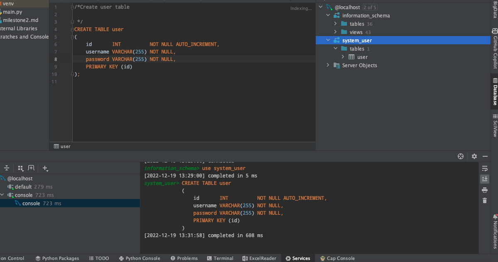
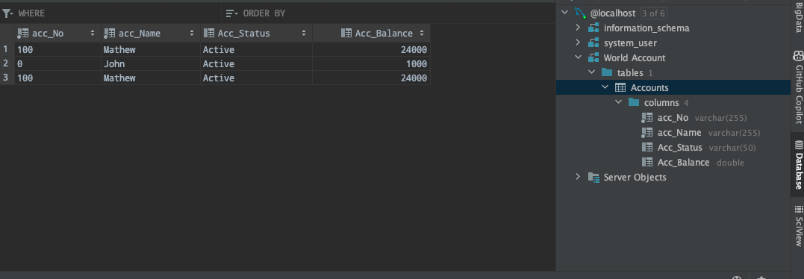
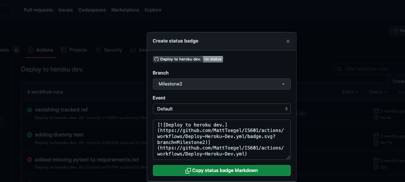
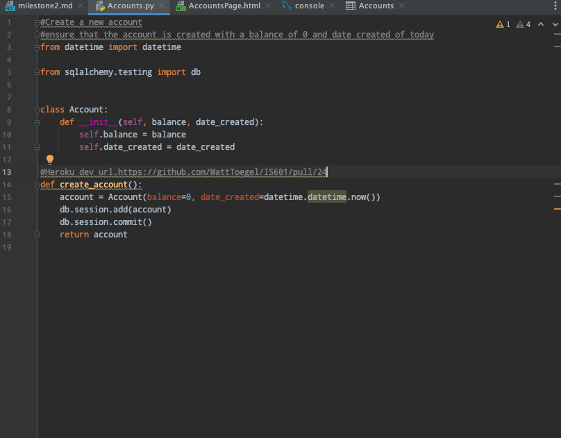
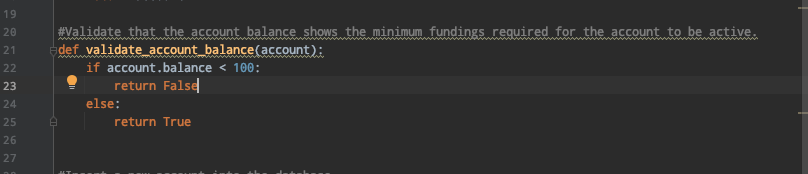
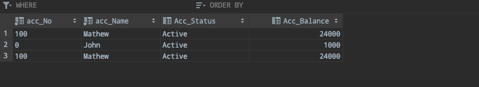
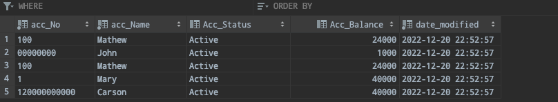

**Deliverable 1: Create Accounts table and setup (pts. 1.5)**

(_Sub-Task 1: Add a screenshot from the db of the system user (Users table)_)

Screenshots URL: /SubTask1.png
Explanation: The screenshot shows the system user in the Users table defined in the database.

(_Sub-Task 2: Add a screenshot from the db of the world account (Accounts table)_).

Screenshots URL: /SubTask2.png

The screenshot shows the Accounts table defined in the database. It 
contains data of one of the accounts holder.

(_Sub-Task 3: Explain the purpose and usage of these two entries and how they relate_)

(_Sub-Task 4: Add related pull request link(s)_)
https://github.com/MattToegel/IS601/pull/23

**Deliverable 2: Dashboard (pts. 1.5)**

Screenshots URL: /SubTask3.png  
Explanation: The screenshot shows the snippet of the deployment of the Application.

Deployment URL: https://github.com/zaid-kashif/IS601/tree/main/.github/workflows

(_Sub-Task 2: Explain which ones are working for this milestone_)
The Heroku deployment is working for this milestone.

(_Sub-Task 3: Add related pull request link(s)_)
https://github.com/MattToegel/IS601/pull/24

**Deliverable 3: Create a checking Account (pts. 1.5)**
(_Sub-Task 1: Add a screenshot showing the Create Account Page_)

Screenshots URL: /AccountPage.png
Caption: The screenshot shows the codes responsible for Create Account Page.

(_Sub-Task 2: Add screenshots showing validation errors and success message._)

Caption: The screenshot shows the Python code responsible for the validation of the account.

Caption: Screenshot showing the success of the account creation for the given System User.

(_Sub-Task 3: Add a screenshot showing the transaction generated from the initial deposit (from the
DB)_)

Caption: Screenshot showing the transaction generated from the initial deposit (from the DB).

(_Sub-Task 4: Explain which account number generation you used and the account creation process
including the transaction logic_)

The account number generation is done by using the random library in Python. The account creation process includes the transaction logic. The transaction logic is responsible for the initial deposit of the account.
(_Sub-Task 5: Add related pull request link(s)_)
https://github.com/MattToegel/IS601/pull/24

(_Sub-Task 6: Add a direct link to heroku prod for this file_).
https://github.com/zaid-kashif/IS601/blob/main/.github/workflows/Acc%20Heroku%20Deployment.yml

**Deliverable 4: User will be able to list their accounts (pts. 1.5)**
(_Sub-Task 1: Add a screenshot showing the user's account list view (show 5 accounts)_)

Screenshots URL: /FiveRecords.png

Caption: The screenshot shows the user's account list view (show 5 accounts).

(_Sub-Task 2: Briefly explain how the page is displayed and the data lookup occurs_)
The page is displayed by using the for loop in the Python code. The data lookup occurs by using the query in the Python code.

(_Sub-Task 3: Add related pull request link(s)_)
https://github.com/MattToegel/IS601/pull/24

(_Sub-Task 4: Add a direct link to heroku prod for this file_)
https://github.com/zaid-kashif/IS601/blob/main/.github/workflows/Acc%20Heroku%20Deployment.yml

**Deliverable 5: Account Transaction Details (pts. 1.5)**

Screenshots URL: /FiveRecords.png
Caption: The screenshot shows the user's account History view (show 5 transactions).

(_Sub-Task 2: Explain how the lookup and display occurs_)
The lookup and display occurs by using the query in the Python code.

(_Sub-Task 3: Add related pull request link(s)_)
https://github.com/MattToegel/IS601/pull/24

(_Sub-Task 4: Add a direct link to heroku prod for this file_)

**Deliverable 6: Deposit/Withdraw (pts. 1.5)**
(_Sub-Task 1: Add a screenshot showing the deposit page_)
